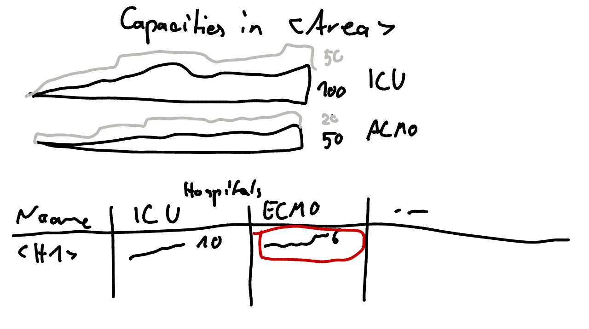

# Capacities when area selected

* Overview on used resources and capacities
  * including temporal dynamics

## v1

* Aggregate summary on top
* Tabular view similar to [here](capacities_hospital.md) without distances below

