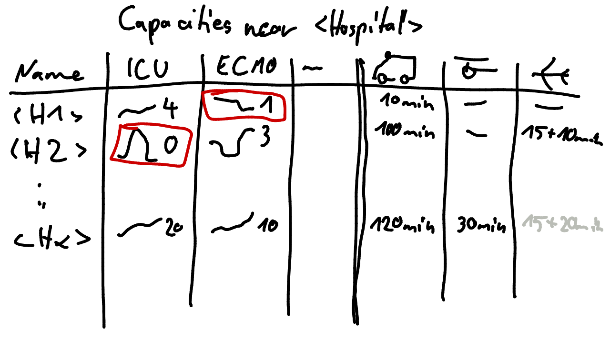

# Capacities View when hospital selected

* Show nearest hospitals with free capacities
  * Capacities (ICU, ECMO…)
  * Time of last update of capacities
  * Distance (km and time) by car and air 
  * Has helipad
* Sorting
  * Free capacity (per type, default by sum desc)
  * Distance time air
  * Distance time land
* Filtering
  * exclude hospitals with more than one change of vehicle (i.e., hosp.->airport->airport->hosp)
  * type available (ICU, ECMO…)
  * exclude ospitals without own helipad
  * maximum travel time
* Interactions
  * Show route and link table row to position in map on hover
  * Select hospital in map on click

## v2

* Add colomn indicating last update of data between capacities and distances

## v1

Tabular view

* Show Name of Hospital
  * Show [tooltip](hospital_tooltip) on hover
* Show sparklines of capacities in last three daays
  * color background according to DIVI status
* Show durations of travel options
  * show dominated options in gray color
  * show distance in km as tooltip

