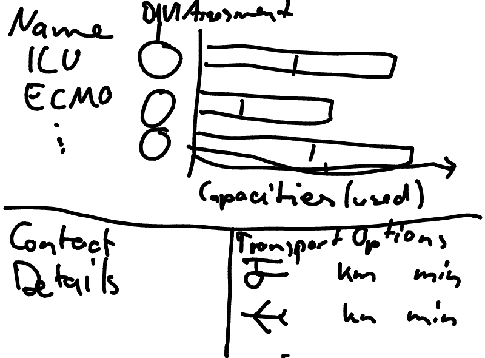

# Hospital tooltip

## v1.0

* Resources (ICU, ECMO…)
  * Show self assesment from DIVI by colored icon
  * Add barchart showing available and used beds (ensure global scale)
* Transport Options
  * Helipad and airport
  * Name of external airport
  * Distance in km and time
* Contact details
  * Address
  * Website
  * Contact person/phone number

