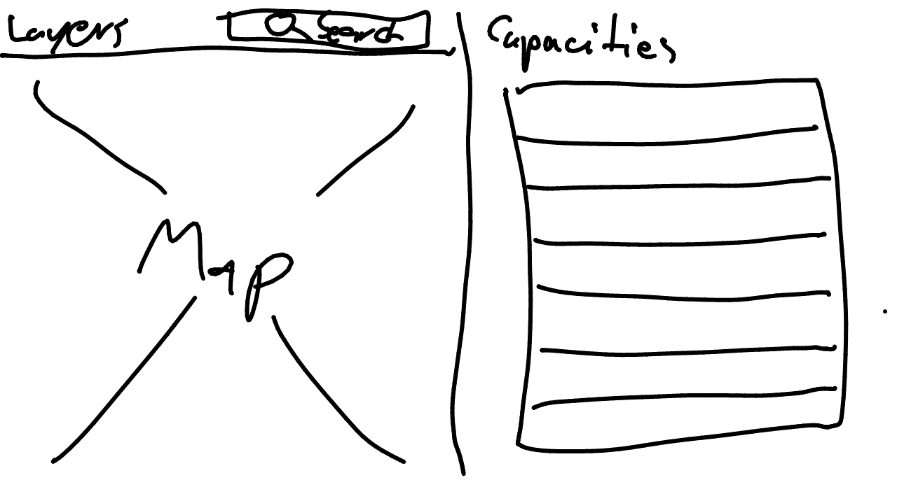

# Mockups for COVID-Vis

## General View

### v1

Map and Capaacitiew Views show the relevant information.
The Map View shows the current status on infectinos and hospitals.
It enables spatial orientation and navigation

The Capacities View aimss at facilitating the redistribution of capacities and patients.
Depending on the selected context in the Map VIEW, the Capacity View highilhgts those hospitals that have spare capacities.

## Main components

### Search

Search for:

* Hospitals
* Landkreise
* Adresses (?)

### Map

#### Layers

Top to bottom:

* Capacity glyphs
  * [Hospitals](hospital_glyph.md)
* Infections by Landkreis
  * Cloropleth  
  * Total and relative to population
* Main streets and airports (?)
  * Autobahnen and Bundesstraßen
  * From OSM
* Full Map
  * From OSM

### Tooltips

Most aggregated to most detailed:

* Landkreis
  * Aggregated resources and capacities
  * Infections
  * Contact details  (Gesundheitsamt (?))
  * Population distribution (?)
* [Hospital](hospital_tooltip.md)
  * Ressources self-assesment (DIVI)
  * Available ressources and capacities (ICU, ECMO…)
  * Has helipad (distance to nearest airport)
  * Contact details

### Capacity view

#### General

* Overview on available and used resources

#### When hospital selected

* Show nearest hospitals with free capacities
  * Capacities (ICU, ECMO…)
  * Distance (km and time) by car and air 
  