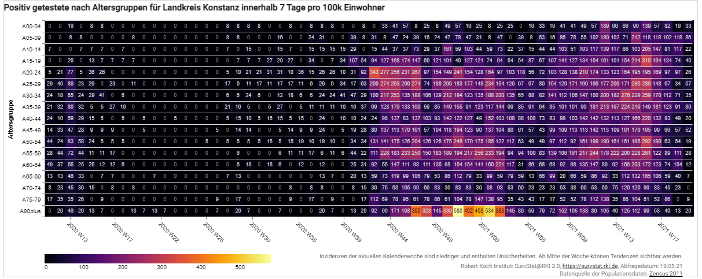
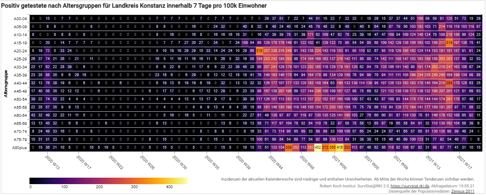

# SurvStat und die Populationsdaten

Am 19.05.2021 wurden wir von [Robert Gieseke darauf hingewiesen](https://github.com/dbvis-ukon/coronavis/issues/1), dass unsere Inzidenzen nach Altersgruppen vermutlich nicht vollständig korrekt sind.
Die [ursprüngliche Entdeckung](https://twitter.com/icestormfr/status/1313855275317825537) dieses Fehlers geht auf [@icestormfr](https://twitter.com/icestormfr) zurück.

## Problemfall: Populationsdaten

Die letzte Volksählung in Deutschland war der [Zensus 2011](https://www.zensus2011.de/DE/Home/home_node.html).
Dort wurden die Populationsdaten auf Gemeindeebene und pro Altersjahr erfasst.
Da sich die Bevölkerungstruktur durchgehend leicht ändert, erstellt das Statistische Bundesamt [Fortschreibungen des Bevölkerungsstandes](https://www-genesis.destatis.de/genesis//online?operation=table&code=12411-0017&bypass=true&levelindex=1&levelid=1621422228814#abreadcrumb).
Zuletzt mit dem Stand 31.12.2019.
Öffentlich zugänglich sind dabei auf Kreisebene aber nur Bevölkerungsdaten nach Alters**gruppen** (z.B. 0-3, 3-6, ...) und nicht nach Alters**jahren**.
[Auf Bundeslandebene sind wiederrum Populationsdaten nach Altersjahren möglich.](https://www-genesis.destatis.de/genesis//online?operation=table&code=12411-0012&bypass=true&levelindex=1&levelid=1621422228814#abreadcrumb)

Das [RKI](https://www.rki.de) mit dem Interface [SurvStat](https://survstat.rki.de) veröffentlicht Inzidenzwerte (für Covid-19 und andere Krankheiten) und auch absolute Werte der Anzahl an positiv getesteten nach Altersjahren.
Da beide Datenwerte abgefragt werden können, haben wir uns dazu entschlossen die Populationsdaten, welche dem [RKI](https://www.rki.de) vorliegen, aus der Inzidenz und den absoluten Zahlen zurückzurechnen.
Dabei erhalten wir Populationsdaten pro Altersjahr und auf Kreisebene.
Fortlaufend fragen wir deshalb immer nur die absoluten Werte bei SurvStat ab und errechnen die Inzidenzwerte selbst.

Hierbei haben nun [@icestormfr](https://twitter.com/icestormfr) und [Robert Gieseke](https://github.com/rgieseke) festgestellt, dass das [RKI](https://www.rki.de)/[SurvStat](https://survstat.rki.de) einen Mittelwert der Populationsdaten errechnet wenn man keinen expliziten Filter für die Jahre 2020 und 2021 setzt.
Hierbei werden also Bevölkerungsstände von mehreren Jahren vermischt was selbstverständlich keinen Sinn ergibt.
Sinnvollerweise würde man die Inzidenzwerte auf die Populationsdaten des entsprechenden Jahres beziehen.

Die Auswirkungen dieses Fehlers sind in den folgenden zwei Bildern beispielhaft für den Landkreis Konstanz dargestellt.

Inzidenzwerte vor der Behebung des Fehlers:

Inzidenzwerte nach der Behebung des Fehlers:

Wie auch schon durch [@icestormfr](https://twitter.com/icestormfr) festgestellt sind die Inzidenzwerte durch den Fehler tendenziell erhöht.
Dies muss allerdings nicht für alle Kreise und Altersgruppen/-jahre generell gelten.

Es bleibt anzumerken, dass alle anderen Inzidenzwerte, welche in [CoronaVis](https://coronavis.dbvis.de) dargestellt werden, nicht von dem Fehler betroffen waren da wir hier bereits die aktuellsten Populationsdaten vom Statistischen Bundesamt verwendet haben und nicht auf die Populationsdaten des [RKI](https://www.rki.de) zurückgegriffen haben.

> Wir bedauern den Fehler und bedanken uns nochmals herzlich bei [@icestormfr](https://twitter.com/icestormfr) und [Robert Gieseke](https://github.com/rgieseke) für die Hinweise und Erläuterungen.